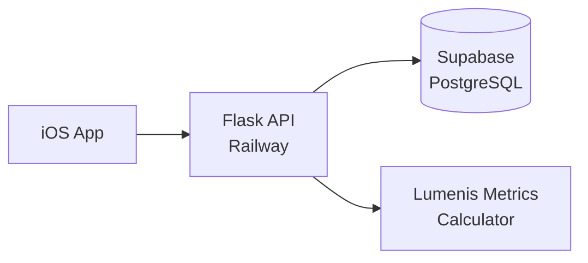

# Lumenis API Blueprint & Documentation

**Version:** 5.4.0 PRODUCTION  
**Database:** v4.1 (Trigger-based event allocation)  
**Status:** Production Ready with Session Validation  
**Last Updated:** 2025-01-09

> **This document serves as the main README for the Lumenis API project**

## 📚 Related Documentation

This API is the source of truth for the entire Lumenis ecosystem. The following blueprints provide comprehensive documentation for different aspects of the system:

### Architecture Blueprints
- **[iOS App Architecture](./blueprint_ios.md)** - Complete iOS app architecture, authentication system, and data flows
- **[Event ID System](./blueprint_eventId.md)** - Detailed specification of the event ID allocation and management system
- **[Recording Flow](./blueprint_recording.md)** - Canonical tagging, recording flow, and database integration specification

### Integration Testing
- **[DB-API Consistency Test](./test_integration_db_api.sh)** - Tests consistency between database architecture and API implementation
- **[iOS-API Consistency Test](./test_integration_ios_api.sh)** - Tests consistency between iOS app architecture and API contracts

> **Note:** The API serves as the source of truth for all architectural decisions and data contracts.

## 📖 Table of Contents

1. [Architecture Overview](#1-architecture-overview)
2. [Canonical Data Model](#2-canonical-data-model)
3. [API Endpoints](#3-api-endpoints)
4. [Database Schema](#4-database-schema)
5. [Validation & Error Handling](#5-validation--error-handling)
6. [Security & Authentication](#6-security--authentication)
7. [Deployment Guide](#7-deployment-guide)
8. [Multi-Device Safety](#8-multi-device-safety)
9. [Examples](#9-examples)
10. [Quick Reference](#10-quick-reference)

---

## 1. Architecture Overview

### System Components



### Component Responsibilities

- **iOS App**
  - Collects RR intervals from sensors
  - Assigns canonical tags and subtags
  - Sends only completed sessions (discards partials)
  - For sleep: sends `event_id=0` for auto-allocation
  - Displays validation reports and DB status in queue UI

- **Backend API (Flask on Railway)**
  - Validates canonical tag/subtag/event_id rules
  - **NEW:** Validates session duration against RR intervals
  - Calculates 9 physiological metrics per session
  - Writes to Supabase using service role (bypasses RLS)
  - Provides analytics endpoints with plot-ready data
  - Returns detailed validation reports with each upload

- **Supabase PostgreSQL**
  - Enforces data integrity via constraints
  - Auto-assigns event_ids via BEFORE INSERT trigger
  - Provides 5 analytics functions for data visualization
  - Maintains per-user monotonic event_id sequence

### Data Flow

1. **Client** → Prepares completed session with canonical tags
2. **API** → Validates tags, duration, calculates metrics
3. **Database** → Triggers assign event_id if needed
4. **Response** → Returns session_id, event_id, validation report, DB status

---

## 2. Canonical Data Model

### Tags & Subtags

| Tag | Allowed Subtags | Event ID Rule | Purpose |
|-----|----------------|---------------|---------|
| `wake_check` | `wake_check_single`<br/>`wake_check_paired_day_pre` | Must be 0 | Morning baseline |
| `pre_sleep` | `pre_sleep_single`<br/>`pre_sleep_paired_day_post` | Must be 0 | Evening baseline |
| `sleep` | `sleep_interval_1`<br/>`sleep_interval_2`<br/>... `sleep_interval_N` | ≥ 0 (0=auto-assign) | Overnight recording |
| `experiment` | `experiment_single`<br/>`experiment_protocol_[a-z0-9_]+` | Must be 0 | Protocol sessions |

### Event ID Rules

```yaml
Non-sleep sessions: event_id = 0 (always)
Sleep sessions:     event_id = 0 (DB auto-assigns) OR > 0 (explicit)
```

### Sleep Event Allocation (NEW - Trigger-based)

- **Preferred**: Send `event_id=0`, DB trigger auto-assigns
- **Optional**: Call allocator endpoint for explicit ID
- **Multi-device safety**: Save returned event_id for interval_2+

### Physiological Metrics (9 Canonical)

```python
{
  "mean_hr": 58.2,      # Average heart rate (bpm)
  "mean_rr": 1030.1,     # Average RR interval (ms)
  "rr_count": 300,       # Number of RR intervals
  "rmssd": 42.1,         # Root mean square of successive differences
  "sdnn": 55.3,          # Standard deviation of NN intervals
  "pnn50": 17.2,         # Percentage of differences > 50ms
  "cv_rr": 5.3,          # Coefficient of variation (%)
  "defa": 1.01,          # DFA α1 (fractal scaling)
  "sd2_sd1": 1.45        # Poincaré plot ratio
}
```

---

## 3. API Endpoints

### 3.1 Health Checks

#### GET `/health`
Basic health check.

**Response:**
```json
{
  "status": "healthy",
  "version": "5.3.1",
  "timestamp": "2025-01-09T10:30:00Z"
}
```

#### GET `/health/detailed`
Detailed health with database connectivity.

**Response:**
```json
{
  "status": "healthy",
  "version": "5.3.1",
  "timestamp": "2025-01-09T10:30:00Z",
  "database": {
    "status": "connected",
    "error": null
  },
  "features": {
    "canonical_tags": true,
    "idempotency": "in-memory",
    "analytics": true,
    "constraints": true,
    "trigger_allocation": true,
    "db_v4_1_compatible": true,
    "duplicate_event_id_return": true
  }
}
```

### 3.2 Session Upload

#### POST `/api/v1/sessions`
#### POST `/api/v1/sessions/upload` (alias)

Upload a Lumenis session with canonical tags.

**Headers:**
- `Content-Type: application/json`
- `Idempotency-Key: <uuid>` (optional, recommended)

**Request Body:**
```json
{
  "session_id": "550e8400-e29b-41d4-a716-446655440000",
  "user_id": "7015839c-4659-4b6c-821c-2906e710a2db",
  "tag": "wake_check",
  "subtag": "wake_check_single",
  "event_id": 0,
  "duration_minutes": 5,
  "recorded_at": "2025-01-09T07:30:00Z",
  "rr_intervals": [869.56, 845.23, 892.34, ...],
  "rr_count": 300  // optional, computed if omitted
}
```

**Response (201 Created):**
```json
{
  "status": "success",
  "session_id": "550e8400-e29b-41d4-a716-446655440000",
  "event_id": 0,  // or assigned ID for sleep
  "db_status": "saved",
  "validation_report": {
    "validation_result": {
      "is_valid": true,
      "errors": [],
      "warnings": []
    },
    "duration_analysis": {
      "ios_duration_minutes": 5,
      "critical_duration_minutes": 5.0,
      "duration_match": true,
      "tolerance_seconds": 5
    },
    "rr_analysis": {
      "rr_count": 300,
      "total_duration_ms": 300000,
      "average_rr_ms": 1000.0
    }
  },
  "metrics": {
    "mean_hr": 58.2,
    "mean_rr": 1030.1,
    "rr_count": 300,
    "rmssd": 42.1,
    "sdnn": 55.3,
    "pnn50": 17.2,
    "cv_rr": 5.3,
    "defa": 1.01,
    "sd2_sd1": 1.45
  }
}
```

**Response (200 Duplicate):**
```json
{
  "status": "duplicate",
  "session_id": "550e8400-e29b-41d4-a716-446655440000",
  "event_id": 42,  // Important for sleep retry safety
  "db_status": "duplicate",
  "message": "Session already exists",
  "validation_report": null  // Not re-validated on duplicates
}
```

### 3.3 Sleep Event Allocation (Optional)

#### POST `/api/v1/sleep/allocate-event-id`

Explicitly allocate an event ID. Most clients should use auto-allocation (send `event_id=0`).

**Request Body:**
```json
{
  "user_id": "7015839c-4659-4b6c-821c-2906e710a2db"
}
```

**Response:**
```json
{
  "event_id": 42,
  "user_id": "7015839c-4659-4b6c-821c-2906e710a2db",
  "message": "Event ID allocated. Note: You can also send event_id=0 to auto-allocate."
}
```

### 3.4 Analytics Endpoints

All analytics endpoints support backward-compatible parameters.

#### GET `/api/v1/analytics/baseline`

Baseline trend analysis (wake_check sessions).

**Query Parameters:**
- `user_id` (required)
- `metric` - One of: `rmssd`, `sdnn`, `sd2_sd1`, `mean_hr`, `mean_rr`, `rr_count`, `pnn50`, `cv_rr`, `defa`
- `window` or `points` - Rolling window size (default: 100)

**Response:**
```json
{
  "status": "success",
  "user_id": "...",
  "metric": "rmssd",
  "window": 7,
  "results": [
    {
      "timestamp": "2025-01-09T07:30:00Z",
      "value": 42.1,
      "rolling_avg": 41.5,
      "rolling_sd": 3.2
    }
  ]
}
```

#### GET `/api/v1/analytics/micro-sleep`

Interval-level sleep analysis (latest sleep event).

**Query Parameters:**
- `user_id` (required)
- `metric` - Same as baseline
- `window` or `points` - Rolling window (default: 30)

**Response includes:**
- `event_id`, `interval_number` per data point

#### GET `/api/v1/analytics/macro-sleep`

Sleep event aggregates.

**Query Parameters:**
- `user_id` (required)
- `metric` - Same as baseline
- `window` or `events` - Number of events (default: 3)

#### GET `/api/v1/analytics/day-load`

Paired wake/pre-sleep analysis.

**Query Parameters:**
- `user_id` (required)
- `metric` - Same as baseline
- `min_hours` - Minimum hours between pairs (default: 12)
- `max_hours` - Maximum hours between pairs (default: 18)

#### GET `/api/v1/analytics/experiment`

Experiment protocol analysis.

**Query Parameters:**
- `user_id` (required)
- `metric` - Same as baseline
- `window` or `points` - Rolling window (default: 100)
- `protocol` - Optional protocol filter (e.g., `cold_shower`)

---

## 4. Database Schema

### Tables

```sql
-- Core tables
public.profiles       -- User profiles
public.sessions       -- Lumenis session data
public.sleep_event_counter  -- Event ID allocation

-- Key columns in sessions
session_id            UUID PRIMARY KEY
user_id               UUID (FK to auth.users)
tag                   TEXT (canonical)
subtag                TEXT (canonical patterns)
event_id              INTEGER (0 for non-sleep, >0 for sleep)
interval_number       INTEGER GENERATED (from subtag)
recorded_at           TIMESTAMPTZ
duration_minutes      INTEGER
rr_intervals          DOUBLE PRECISION[]
rr_count              INTEGER
-- 9 physiological metrics
mean_hr, mean_rr, rmssd, sdnn, pnn50, cv_rr, defa, sd2_sd1
```

### Constraints

- `chk_tag_values` - Valid tags only
- `chk_subtag_by_tag` - Subtag patterns per tag
- `chk_sleep_grouping` - Event ID rules
- `uq_sleep_interval_per_user_event` - No duplicate intervals

### Trigger-based Event Allocation

```sql
-- BEFORE INSERT trigger for sleep sessions
-- If tag='sleep' AND event_id=0:
--   interval_1 → allocates new event_id
--   interval_2+ → attaches to latest event
```

### Analytics Functions

```sql
fn_baseline_points(p_user_id, p_metric, p_window)
fn_micro_sleep_points(p_user_id, p_metric, p_window)
fn_macro_sleep_points(p_user_id, p_metric, p_window)
fn_day_load_points(p_user_id, p_metric, p_min_hours, p_max_hours)
fn_experiment_points(p_user_id, p_metric, p_window, p_protocol_subtag)
```

---

## 5. Validation & Error Handling

### Validation Rules

```yaml
tag:              Must be in [wake_check, pre_sleep, sleep, experiment]
subtag:           Must match regex pattern for tag
event_id:         0 for non-sleep, >=0 for sleep
user_id:          Valid UUID format
session_id:       Valid UUID format
duration_minutes: Integer > 0
recorded_at:      ISO 8601 with timezone
rr_intervals:     Non-empty array, values 200-2000ms
rr_count:         Must match array length (if provided)

# NEW: Duration Validation
duration_consistency: iOS duration must match RR intervals (±5s tolerance)
  - Critical duration = sum(rr_intervals) / 60000
  - Pass if: |ios_duration - critical_duration| <= 5/60 minutes
  - Fail if: Discrepancy > 5 seconds
```

### Error Responses

| Status | Meaning | Example |
|--------|---------|---------|  
| 400 | Validation failed | Invalid tag/subtag, duration mismatch |
| 409 | Duplicate session | Session ID exists |
| 422 | Metrics calculation failed | Invalid RR data |
| 500 | Server error | Database connection failed |

### Validation Report Structure

```json
{
  "validation_result": {
    "is_valid": boolean,
    "errors": ["Duration mismatch: iOS=5min, RR=3min"],
    "warnings": ["Minor duration discrepancy: 3s"]
  },
  "duration_analysis": {
    "ios_duration_minutes": number,
    "critical_duration_minutes": number,
    "duration_match": boolean,
    "tolerance_seconds": 5
  },
  "rr_analysis": {
    "rr_count": number,
    "total_duration_ms": number,
    "average_rr_ms": number
  }
}
```

### Trigger Error Mapping

```python
"Cannot attach interval" → "Start with sleep_interval_1"
"Out-of-order interval" → "Upload intervals sequentially"
"Invalid sleep subtag" → "Must be sleep_interval_N"
```

---

## 6. Security & Authentication

### Connection Security

- **API → Database**: Service role credentials (bypasses RLS)
- **Never expose**: Service role key to clients
- **Connection**: SSL/TLS required
- **CORS**: Restrict to app domains

### Future Authentication

```yaml
TODO: Add JWT validation
- Validate JWT signature
- Extract user_id from token
- Reject body/token user_id mismatch
```

---

## 7. Deployment Guide

### Environment Variables

```bash
# Database (Supabase)
SUPABASE_DB_HOST=aws-0-us-west-1.pooler.supabase.com
SUPABASE_DB_PORT=5432
SUPABASE_DB_NAME=postgres
SUPABASE_DB_USER=postgres.xxxxx
SUPABASE_DB_PASSWORD=xxxxx

# API Configuration
LOG_LEVEL=INFO
FLASK_ENV=production
CORS_ORIGINS=https://yourapp.com
PORT=5000  # Railway assigns
```

### File Structure

```
project/
├── app.py                # API v5.4.0
├── database_config.py    # Connection management
├── hrv_metrics.py       # Physiological calculations
├── session_validator.py  # Duration/RR validation module
├── .env.railway         # Environment variables
├── requirements.txt     # Dependencies
└── README.md           # This document
```

### Railway Deployment

```bash
# requirements.txt
Flask==2.3.3
flask-cors==4.0.0
psycopg2-binary==2.9.7
python-dotenv==1.0.0
numpy==1.24.3
gunicorn==21.2.0

# Procfile (optional, Railway auto-detects)
web: gunicorn -w 2 -k gthread -t 60 app:app
```

---

## 8. Multi-Device Safety

### Sleep Recording Best Practices

```yaml
For sleep_interval_1:
  1. Send event_id=0
  2. Save returned event_id from response
  
For sleep_interval_2+:
  1. Send the saved event_id explicitly
  2. Never rely on auto-attach for multi-device scenarios
```

### Why This Matters

- Prevents cross-device event mixing
- Ensures intervals stay grouped correctly
- Handles network retries safely (returns event_id on duplicates)

---

## 9. Examples

### Example 1: Wake Check Session

```bash
curl -X POST https://api.yourdomain.com/api/v1/sessions \
  -H "Content-Type: application/json" \
  -H "Idempotency-Key: 550e8400-e29b-41d4-a716-446655440001" \
  -d '{
    "session_id": "550e8400-e29b-41d4-a716-446655440000",
    "user_id": "7015839c-4659-4b6c-821c-2906e710a2db",
    "tag": "wake_check",
    "subtag": "wake_check_single",
    "event_id": 0,
    "duration_minutes": 5,
    "recorded_at": "2025-01-09T07:30:00Z",
    "rr_intervals": [869.56, 845.23, 892.34],
    "rr_count": 3
  }'
```

### Example 2: Sleep Recording Flow

```python
# Step 1: Start sleep (interval 1)
response = post("/api/v1/sessions", {
    "tag": "sleep",
    "subtag": "sleep_interval_1", 
    "event_id": 0,  # Auto-allocate
    ...
})
saved_event_id = response["event_id"]  # Save this!

# Step 2: Continue sleep (interval 2)
post("/api/v1/sessions", {
    "tag": "sleep",
    "subtag": "sleep_interval_2",
    "event_id": saved_event_id,  # Use saved ID
    ...
})
```

### Example 3: Analytics Query

```bash
# Get baseline trend for last 7 wake_check sessions
GET /api/v1/analytics/baseline?user_id=xxx&metric=rmssd&window=7

# Get latest sleep event analysis
GET /api/v1/analytics/micro-sleep?user_id=xxx&metric=mean_hr&window=5

# Get day-load pairs
GET /api/v1/analytics/day-load?user_id=xxx&metric=rmssd&min_hours=12&max_hours=18
```

---

## 10. Quick Reference

### Related Documentation Links

#### Architecture Documents
- [iOS App Blueprint](./blueprint_ios.md) - Complete iOS architecture and implementation details
- [Event ID Blueprint](./blueprint_eventId.md) - Event ID allocation system specification
- [Recording Blueprint](./blueprint_recording.md) - Recording flow and canonical tagging rules

#### Testing & Validation
- [DB-API Integration Test](./test_integration_db_api.sh) - Validates database and API consistency
- [iOS-API Integration Test](./test_integration_ios_api.sh) - Validates iOS and API consistency

#### Deployment & Configuration
- [Railway Configuration](./railway.json) - Railway deployment settings
- [Nixpacks Configuration](./nixpacks.toml) - Build configuration for Railway
- [Environment Template](./.env.railway) - Environment variables template

> **Remember:** This API blueprint serves as the authoritative source for all system contracts and behaviors.

### Canonical Tags

```python
CANONICAL_TAGS = ['wake_check', 'pre_sleep', 'sleep', 'experiment']
```

### Valid Metrics

```python
VALID_METRICS = ['rmssd', 'sdnn', 'sd2_sd1', 'mean_hr', 'mean_rr', 
                 'rr_count', 'pnn50', 'cv_rr', 'defa']
```

### Subtag Patterns

```regex
wake_check:  ^wake_check_(single|paired_day_pre)$
pre_sleep:   ^pre_sleep_(single|paired_day_post)$
sleep:       ^sleep_interval_[1-9][0-9]*$
experiment:  ^experiment_(single|protocol_[a-z0-9_]+)$
```

### Response Status Codes

```yaml
200: OK (query successful, duplicate session)
201: Created (new session)
400: Bad Request (validation error)
409: Conflict (duplicate with different data)
422: Unprocessable (Metrics calc failed)
500: Server Error
```

### Database Functions

```sql
-- All use p_window parameter (not p_points/p_events)
fn_baseline_points(p_user_id, p_metric, p_window)
fn_micro_sleep_points(p_user_id, p_metric, p_window)
fn_macro_sleep_points(p_user_id, p_metric, p_window)
fn_day_load_points(p_user_id, p_metric, p_min_hours, p_max_hours)
fn_experiment_points(p_user_id, p_metric, p_window, p_protocol_subtag)
```

---

## Version History

- **v5.4.0** (2025-01-09) - Added session validator module, duration/RR validation
- **v5.3.1** (2025-01-09) - Returns event_id on duplicates, DB v4.1 compatible
- **v5.3.0** (2025-01-09) - DB v4.0 compatibility, p_window parameters
- **v5.2.0** (2025-01-08) - Trigger-based allocation support
- **v5.0.0** (2025-01-07) - Initial production release

---

## Support

For issues or questions:
- Check trigger error messages in logs
- Verify subtag patterns match exactly
- Ensure event_id rules are followed
- Use idempotency keys for critical sessions

---

**END OF BLUEPRINT**